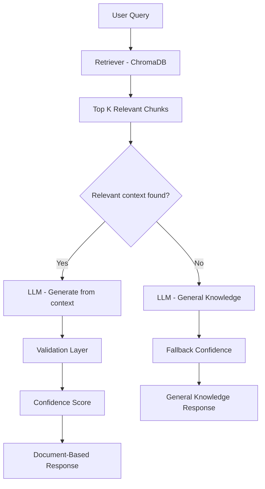

# Leela Krishna.T

> 💡 Building enterprise-grade Agentic AI systems for regulated environments, with a focus on reliability, traceability, validation, and governance.

Director | Data, AI & ML Leader | Agentic AI & RAG | LLM Systems | Enterprise AI Transformation

---

## About Me

- Director-level technology leader with 20+ years of experience in Data, AI, and Banking
- Expertise in regulatory data platforms, compliance, and data engineering
- Currently focused on Agentic AI and RAG-based enterprise solutions
- Passionate about building scalable, explainable, and enterprise-grade AI systems
- Focused on building reliable and explainable AI systems for enterprise and regulatory environments

---

## Core Skills

- Generative AI (RAG, LLMs, Prompt Engineering)
- Agentic AI & AI System Design
- Machine Learning and NLP
- Vector Databases (ChromaDB)
- Data Engineering (ETL, Big Data, Data Platforms)
- Python, SQL, Spark
- Azure AI and Cloud Technologies

---

## Certifications

- Microsoft Certified: Azure AI Engineer Associate (AI-102)
- Microsoft Certified: Azure Data Scientist Associate (DP-100)
- Microsoft Certified: Azure AI Fundamentals (AI-900)
- UBS Certified Data Scientist
- UBS Certified Data Analyst
- UBS Certified Engineer – Gold
- UBS Certified Engineer – Silver
- UBS Certified Engineer – Base
- IBM Certified Machine Learning

---

## Featured Projects

### 1. Agentic AI Compliance Assistant (Latest)

An enterprise-grade AI assistant designed for compliance use cases using Retrieval-Augmented Generation (RAG), validation, and confidence scoring.

**Key Highlights:**
- Built an end-to-end Agentic AI pipeline (Retrieval → Context Evaluation → Generation → Validation → Fallback → Confidence)
- Implemented document-grounded response generation using ChromaDB
- Designed a validation layer to ensure response correctness
- Added confidence scoring to indicate strength of supporting evidence
- Implemented controlled fallback to general knowledge for out-of-scope queries
- Developed an interactive Streamlit-based UI

**Impact:**
- Designed to reduce hallucination risk and improve trust in AI-driven compliance workflows
- Ensures transparency by distinguishing between document-grounded and general knowledge responses

**Tech Stack:** Python, Streamlit, LangChain, ChromaDB, OpenAI

👉 GitHub: https://github.com/leelakrishna-cloud/agentic-ai-compliance-assistant

---

### 2. RAG-Based PDF Chatbot (GenAI)

A document-based chatbot for PDF question answering using RAG architecture.

**Key Highlights:**
- Built an end-to-end RAG pipeline
- Implemented document ingestion, chunking, embeddings, and vector search
- Used ChromaDB and LlamaCpp (BioMistral) for response generation
- Developed a Gradio-based chatbot UI

👉 GitHub: https://github.com/leelakrishna-cloud/rag-pdf-chatbot

---

## Key Differentiator

Unlike traditional chatbots, my solutions focus on:

- Document grounding (RAG)
- Validation of responses
- Confidence scoring
- Controlled fallback mechanisms

This ensures reliable, explainable, and enterprise-ready AI systems.

---

## Architecture (Agentic AI)

**RAG retrieves information. Agentic AI ensures reliability and trust.**

---

## Currently focused on advancing:

- Agentic AI architectures
- Advanced LLM applications
- Enterprise AI system design and governance

---

## Education

Currently pursuing a **Ph.D. in Management (Business Analytics & AI/ML)** at SRM University, India (expected 2029), focused on applying AI and machine learning to real-world business and banking challenges.

---

## Connect

- LinkedIn: [Leela Krishna.T](https://www.linkedin.com/in/leelakrishnas/)
- Email: leelakrishnan@yahoo.com

---

Focused on advancing Agentic AI adoption in enterprise environments, particularly within regulated industries.
