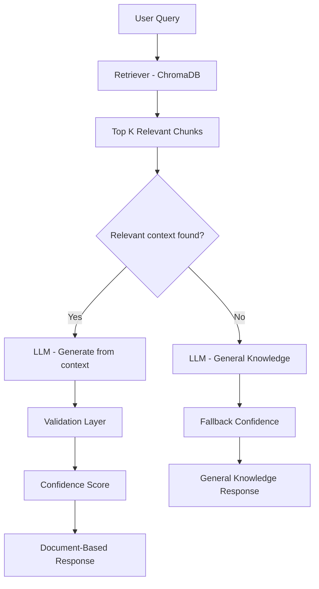

# Leela Krishna.T

> 💡 Building enterprise-grade Agentic AI systems for regulated environments, with a focus on reliability, traceability, validation, and governance.

Director | Data, AI & ML Leader | Agentic AI & RAG | LLM Systems | Enterprise AI Transformation

---

## About Me

- Director-level technology leader with 20+ years of experience in Data, AI, and Banking  
- Expertise in regulatory data platforms, compliance, and data engineering  
- Currently focused on building Agentic AI solutions for enterprise and compliance environments, with an emphasis on Retrieval-Augmented Generation (RAG), validation, and governed AI behavior  
- Focused on building reliable, explainable, and governed AI systems for regulated environments    

---

## Core Skills

- Generative AI (RAG, LLMs, Prompt Engineering)  
- Agentic AI & AI System Design  
- Machine Learning & NLP  
- Vector Databases (FAISS, ChromaDB)  
- Data Engineering (ETL, Big Data, Data Platforms)  
- Python, SQL, Spark  
- Azure AI & Cloud Technologies  

---

## Certifications

- Microsoft Certified: Azure AI Engineer Associate (AI-102)
- Microsoft Certified: Azure Data Scientist Associate (DP-100)
- Microsoft Certified: Azure AI Fundamentals (AI-900)
- UBS Certified Data Scientist
- UBS Certified Data Analyst
- UBS Certified Engineer – Gold
- UBS Certified Engineer – Silver
- UBS Certified Engineer – Base
- IBM Certified Machine Learning

---

## Featured Projects

### 1. Agentic AI Compliance Assistant (v2)

An enterprise-grade Agentic AI solution designed for compliance use cases, delivering trusted, explainable, and governed regulatory intelligence.

**Key Highlights:**
- Built an end-to-end Agentic AI architecture (Retrieve → Generate → Validate → Decide → Respond)  
- Implemented document-grounded response generation using FAISS-based vector search  
- Designed a validation layer for response support classification (SUPPORTED / PARTIAL / UNSUPPORTED)  
- Added confidence scoring to indicate strength of supporting evidence  
- Implemented controlled AI-assisted fallback for unsupported queries  
- Developed an interactive Streamlit-based UI  

**Impact:**
- Reduces hallucination risk in AI-driven compliance workflows  
- Ensures transparency through validation and source traceability  
- Enables reliable and governed AI responses for regulatory environments  

**Tech Stack:** Python, Streamlit, LangChain, FAISS, OpenAI  

👉 GitHub: https://github.com/leelakrishna-cloud/agentic-ai-compliance-assistant-v2

---

### 2. RAG-Based PDF Chatbot

A document-based chatbot for PDF question answering using Retrieval-Augmented Generation (RAG).

**Key Highlights:**
- Built an end-to-end RAG pipeline  
- Implemented document ingestion, chunking, embeddings, and vector search  
- Used ChromaDB and LLMs (LlamaCpp - BioMistral) for response generation  
- Developed a chatbot UI  

👉 GitHub: https://github.com/leelakrishna-cloud/rag-pdf-chatbot

---

## Key Differentiator

Unlike traditional RAG-based systems (Retrieve → Generate → Return), my solutions incorporate:

- Document-grounded response generation  
- Validation and support classification  
- Confidence scoring  
- Controlled AI-assisted fallback  
- Decision logic for response strategy  

This enables reliable, explainable, and governed AI systems suitable for enterprise and compliance environments.

---

## Architecture (Agentic AI)

**RAG retrieves information. Agentic AI ensures reliability, traceability, validation, and governance.**

---

## Currently Focused On

- Advancing Agentic AI architectures  
- Building advanced LLM applications  
- Designing enterprise-grade AI systems with governance and control  

---

## Education

Currently pursuing a **Ph.D. in Management (Business Analytics & AI/ML)** at SRM University, India (expected 2029), focused on applying AI and machine learning to real-world business and banking challenges.

---

## Connect

- LinkedIn: [Leela Krishna.T](https://www.linkedin.com/in/leelakrishnas/)
- Email: leelakrishnan@yahoo.com

---

Focused on advancing Agentic AI adoption in enterprise environments, particularly within regulated industries.
